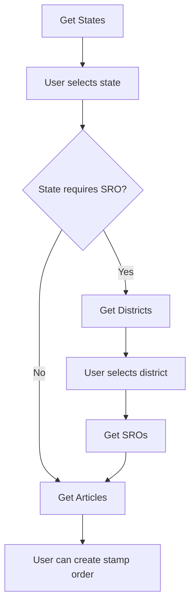

# 📊 Data APIs Reference

The Data APIs provide all the reference information you need to create stamp orders. **No authentication required** for these endpoints.

## 🌍 States API

Get list of all states where stamp duty services are available.

### Endpoint
```http
GET /data/states
```

### Response
```json
{
  "success": true,
  "data": [
    {
      "name": "Assam",
      "code": "AS",
      "minAmount": 100,
      "maxAmount": null,
      "cessRequired": false,
      "propertyAreaRequired": false,
      "sroRequired": true,
      "isTraditional": false
    },
    {
      "name": "Delhi",
      "code": "DL",
      "minAmount": 10,
      "maxAmount": 500,
      "cessRequired": false,
      "propertyAreaRequired": false,
      "sroRequired": false,
      "isTraditional": false
    }
  ],
  "count": 25
}
```

### Field Explanations

| Field | Type | Description |
|-------|------|-------------|
| `name` | string | Full state name - **use this in stamp orders** |
| `code` | string | State code - use this for other data APIs |
| `minAmount` | number/null | Minimum stamp amount allowed |
| `maxAmount` | number/null | Maximum stamp amount (null = no limit) |
| `cessRequired` | boolean | Whether cess amount is mandatory |
| `propertyAreaRequired` | boolean | Whether property area must be specified |
| `sroRequired` | boolean | Whether district and SRO must be selected |
| `isTraditional` | boolean | Whether traditional stamp paper is used |

### Usage Tips
- **Cache this data** - states don't change frequently
- **Use `name` field** for stamp order API, not `code`
- **Check requirements** before showing UI fields to users

---

## 🏘️ Districts API

Get all districts for a specific state.

### Endpoint
```http
GET /data/districts?stateCode={STATE_CODE}
```

### Parameters
- `stateCode` (required): State code from States API (e.g., "AS", "DL", "HR")

### Examples
```http
GET /data/districts?stateCode=AS
GET /data/districts?stateCode=DL
GET /data/districts?stateCode=HR
```

### Response
```json
{
  "success": true,
  "stateCode": "AS",
  "data": [
    {
      "code": "AS-BK",
      "name": "Baksa"
    },
    {
      "code": "AS-BR",
      "name": "Barpeta"
    },
    {
      "code": "AS-MO",
      "name": "Morigaon"
    }
  ],
  "count": 32
}
```

### Field Explanations

| Field | Type | Description |
|-------|------|-------------|
| `code` | string | District code - **use this for SROs API and stamp orders** |
| `name` | string | District name for display purposes |

### Error Responses
```json
// Missing state code
{
  "error": "State code is required. Please provide stateCode parameter."
}

// Invalid state code
{
  "error": "Invalid state code format. Expected 2-3 uppercase letters."
}

// State not found
{
  "error": "State configuration not found for: XYZ"
}
```

---

## 🏢 SROs API

Get Sub Registrar Offices for a specific district.

### Endpoint
```http
GET /data/sros?stateCode={STATE_CODE}&districtCode={DISTRICT_CODE}
```

### Parameters
- `stateCode` (required): State code from States API
- `districtCode` (required): District code from Districts API

### Examples
```http
GET /data/sros?stateCode=AS&districtCode=AS-MO
GET /data/sros?stateCode=HR&districtCode=HR-GG
```

### Response
```json
{
  "success": true,
  "stateCode": "AS",
  "districtCode": "AS-MO",
  "data": [
    {
      "code": "AS-MRG",
      "name": "Morigaon"
    }
  ],
  "count": 1
}
```

### Field Explanations

| Field | Type | Description |
|-------|------|-------------|
| `code` | string | SRO code - **use this for stamp orders** |
| `name` | string | SRO name for display purposes |

### When SROs are Required
Only call this API if the state has `sroRequired: true` in the States API response.

### Error Responses
```json
// Missing parameters
{
  "error": "State code and district code are required. Please provide both stateCode and districtCode parameters."
}

// Invalid district for state
{
  "error": "District 'XYZ' not found for state: Assam"
}

// No SRO data available
{
  "error": "SRO data not found for state: AS, district: AS-XX"
}
```

---

## 📋 Articles API

Get all available article codes and descriptions for a specific state.

### Endpoint
```http
GET /data/articles?stateCode={STATE_CODE}
```

### Parameters
- `stateCode` (required): State code from States API

### Examples
```http
GET /data/articles?stateCode=AS
GET /data/articles?stateCode=DL
```

### Response
```json
{
  "success": true,
  "stateCode": "AS",
  "data": [
    {
      "code": "AS-RG-1",
      "description": "1 - Acknowledgement",
      "popular": true,
      "minimumAmount": 1,
      "allowedAmounts": null,
      "isSecondPartyNA": false
    },
    {
      "code": "AS-RG-4",
      "description": "4 - Affidavit",
      "popular": true,
      "minimumAmount": 100,
      "allowedAmounts": [100, 200, 500],
      "isSecondPartyNA": false
    },
    {
      "code": "AS-RG-16",
      "description": "23 - Conveyance",
      "popular": true,
      "minimumAmount": 1,
      "allowedAmounts": null,
      "isSecondPartyNA": false
    }
  ],
  "count": 59
}
```

### Field Explanations

| Field | Type | Description |
|-------|------|-------------|
| `code` | string | Article code - **use this for stamp orders** |
| `description` | string | Article description for display |
| `popular` | boolean | Whether this is commonly used (show first in UI) |
| `minimumAmount` | number | Minimum stamp amount for this article |
| `allowedAmounts` | array/null | Specific allowed amounts (null = any amount ≥ minimum) |
| `isSecondPartyNA` | boolean | Whether second party details are not applicable |

### Important Validation Rules

1. **Minimum Amount**: Stamp amount must be ≥ `minimumAmount`
2. **Allowed Amounts**: If `allowedAmounts` is not null, stamp amount must be one of those values
3. **Second Party**: If `isSecondPartyNA` is true, don't require second party details

### Usage Examples

```javascript
// Filter popular articles for better UX
const popularArticles = articles.data.filter(article => article.popular);

// Validate stamp amount
function validateAmount(articleCode, stampAmount) {
  const article = articles.data.find(a => a.code === articleCode);

  if (stampAmount < article.minimumAmount) {
    return `Minimum amount for this article is ₹${article.minimumAmount}`;
  }

  if (article.allowedAmounts && !article.allowedAmounts.includes(stampAmount)) {
    return `Allowed amounts: ₹${article.allowedAmounts.join(', ')}`;
  }

  return null; // Valid
}
```

---

## 🔄 API Call Flow

Here's the recommended sequence for getting all required data:



### Sample Implementation

```javascript
async function setupStampOrder() {
  // 1. Get all states
  const states = await fetch('/api/v1/data/states').then(r => r.json());

  // 2. User selects a state
  const selectedState = states.data.find(s => s.name === userSelectedStateName);

  // 3. Get articles for the state
  const articles = await fetch(`/api/v1/data/articles?stateCode=${selectedState.code}`)
    .then(r => r.json());

  // 4. If SRO is required, get districts
  if (selectedState.sroRequired) {
    const districts = await fetch(`/api/v1/data/districts?stateCode=${selectedState.code}`)
      .then(r => r.json());

    // 5. User selects district, then get SROs
    const sros = await fetch(`/api/v1/data/sros?stateCode=${selectedState.code}&districtCode=${userSelectedDistrict}`)
      .then(r => r.json());
  }

  // Now you have all data needed for stamp order creation
}
```

---

## 💡 Best Practices

### Caching Strategy
- **States**: Cache for 24 hours (rarely change)
- **Districts**: Cache for 12 hours
- **Articles**: Cache for 6 hours
- **SROs**: Cache for 1 hour (most dynamic)

### Error Handling
```javascript
async function fetchWithRetry(url, retries = 3) {
  for (let i = 0; i < retries; i++) {
    try {
      const response = await fetch(url);
      if (response.ok) return response.json();
      if (response.status === 404) throw new Error('Data not found');
    } catch (error) {
      if (i === retries - 1) throw error;
      await new Promise(resolve => setTimeout(resolve, 1000 * (i + 1)));
    }
  }
}
```

### Performance Tips
1. **Parallel requests**: Fetch articles and districts simultaneously if both needed
2. **Progressive loading**: Load states first, then fetch other data based on user selection
3. **Client-side validation**: Use article constraints to validate before API calls
4. **Debounce**: Wait for user to finish typing before making API calls

---

## 🆘 Common Issues

### Issue: "State configuration not found"
**Cause**: Using invalid state code
**Solution**: Always use state codes from the States API response

### Issue: "District not found for state"
**Cause**: Using district code from wrong state
**Solution**: Fetch districts for each state separately

### Issue: Empty SRO response
**Cause**: Some districts may not have SRO data available yet
**Solution**: Show appropriate message and allow user to proceed without SRO

### Issue: Articles not loading
**Cause**: State doesn't have article configuration
**Solution**: Contact support - this shouldn't happen for supported states

For more help, contact support@esahayak.io
